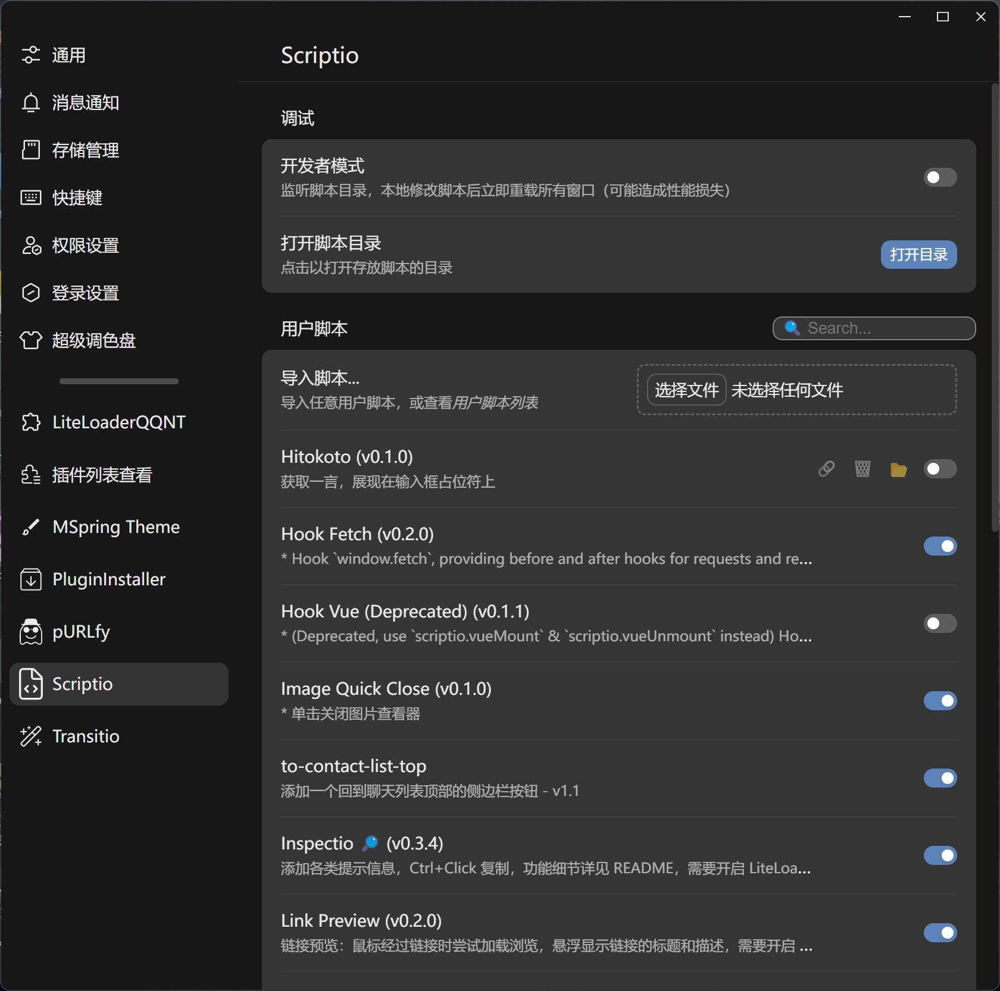

</img>

# Scriptio

> [!NOTE]
> 此插件 `1.0.0` 版本及以上最低支持 LiteLoaderQQNT 1.0.0，之前版本的 LiteLoaderQQNT 请使用 `1.0.0` 之前的 Release

[LiteLoaderQQNT](https://github.com/mo-jinran/LiteLoaderQQNT) 插件，用于为 QQNT 加载任意**渲染层**的 JavaScript 片段。

你可能也感兴趣：[Transitio](https://github.com/PRO-2684/transitio)，自定义 CSS 片段加载器。

## 🪄 具体功能

- 导入 js 代码片段
- 启用/禁用 js 代码片段
    - 约定：说明若以 `* ` 开头，则启用/禁用此脚本需要重启/重载 *被注入此脚本的窗口* 生效，否则立即生效
    - 由于 js 代码的复杂性，立即生效由脚本自行实现，Scriptio 仅提供 `scriptio-toggle` 事件以供脚本监听 (参考 [Wiki](https://github.com/PRO-2684/Scriptio/wiki) 中的 [响应性脚本](https://github.com/PRO-2684/Scriptio/wiki/%E7%94%A8%E6%88%B7%E8%84%9A%E6%9C%AC%E5%BC%80%E5%8F%91#%E5%93%8D%E5%BA%94%E6%80%A7%E8%84%9A%E6%9C%AC) 章节)

## 🖼️ 截图

> 演示中使用了 [MSpring-Theme](https://github.com/MUKAPP/LiteLoaderQQNT-MSpring-Theme)，主题色为 `#74A9F6`。



## 📥 安装
### 稳定版

下载 Release 中的 `scriptio-release.zip`，解压后放入[数据目录](https://github.com/mo-jinran/LiteLoaderQQNT-Plugin-Template/wiki/1.%E4%BA%86%E8%A7%A3%E6%95%B0%E6%8D%AE%E7%9B%AE%E5%BD%95%E7%BB%93%E6%9E%84#liteloader%E7%9A%84%E6%95%B0%E6%8D%AE%E7%9B%AE%E5%BD%95)下的 `plugins/Scriptio` 文件夹中即可。(若没有该文件夹请自行创建)

### CI 版

若想体验最新的 CI 功能，可以下载源码后同上安装。(仅需下载下面列出的文件)

完成后的目录结构应该如下:

```
plugins (所有的插件目录)
└── Scriptio (此插件目录)
    ├── manifest.json (插件元数据)
    ├── main.js (插件脚本)
    ├── preload.js (插件脚本)
    ├── renderer.js (插件脚本)
    ├── settings.html (插件设置界面)
    └── icons/ (插件用到的图标)
```

## 🤔 使用方法

> [!WARNING]
> 由于 js 代码的复杂性，禁用/修改部分脚本可能需要**重启/重载生效**

- 启用/禁用脚本：打开插件设置界面，将对应的脚本开关打开/关闭。
    - 若点击各个开关速度过快，可能会导致错位等情况，此时请重载窗口。
- 导入脚本：在配置界面导入 JS 文件，或将之放入 `data/Scriptio/scripts/` 文件夹。
    - 用户脚本的编写请参考 [Wiki](https://github.com/PRO-2684/Scriptio/wiki)。
    - 可以在此文件夹下创建多层目录，插件会自动扫描所有 JS 文件，但是设置界面导入的还是默认直接放在 `data/scriptio/scripts/` 下
- 删除脚本：鼠标悬停在脚本上并点击删除 `🗑️` 按钮，或进入，或进入 `data/scriptio/scripts/` 文件夹删除对应文件。
- 修改脚本：修改对应文件即可。
    - 鼠标悬停在脚本标题上时，会显示其绝对路径。
    - 鼠标悬停在脚本上时，会展示 "在文件夹中显示" 按钮。
- 更新脚本：重新导入即可。
- 重载脚本：双击 "导入脚本..."。

## 💻 调试

- 开发者模式：若您想要调试**您的用户脚本**，可以在插件设置界面打开*开发者模式*，此时插件会监控 `data/scriptio/scripts/` 文件夹，当发生更改时，会自动重载。
- Debug 模式：若您想要调试**此插件本身**，可以使用 `--scriptio-debug` 参数启动 QQNT，此时插件会在控制台输出调试信息。

## 📜 用户脚本

> [!NOTE]
> 以下脚本均为由我/其它用户编写的用户脚本，不内置在插件中。
>
> 若你有愿意分享的脚本，欢迎[提交 PR 或 Issue](https://github.com/PRO-2684/Scriptio/issues/1) 来将它们添加到这里。编写脚本前推荐先阅读 [Wiki](https://github.com/PRO-2684/Scriptio/wiki)。

| 名称 | 实时响应 | 作者 | 说明 |
| --- | --- | --- | --- |
| [Automatic-text-to-voice-conversion.js](https://github.com/Shapaper233/Shapaper-Scriptio-user-scripts/#Automatic-text-to-voice-conversion) | 🟢 | [Shapaper](https://github.com/Shapaper233) | 文字自动转语音！让我看看谁在语音没有麦克风😂游戏切换界面很麻烦？那就用这个插件把他的消息读出来吧！|
| [Automatic-voice-to-text-conversion](https://github.com/Shapaper233/Shapaper-Scriptio-user-scripts/#Automatic-voice-to-text-conversion) | 🟢 | [Shapaper](https://github.com/Shapaper233) | 语音自动转文字！再也不需要手动右键转文字了！Need: Scriptio v1.3.4+|
| [Group-name-completion](https://github.com/Shapaper233/Shapaper-Scriptio-user-scripts/#Group-name-completion) | 🟢 | [Shapaper](https://github.com/Shapaper233) | 给群昵称添加更多信息！ |
| [hitokoto](https://github.com/PRO-2684/Scriptio-user-scripts/#hitokoto) | 🟢 | [PRO-2684](https://github.com/PRO-2684) | 输入框展示一言 |
| [hook-vue](https://github.com/PRO-2684/Scriptio-user-scripts/#hook-vue) | 🔴 | [PRO-2684](https://github.com/PRO-2684) | Hook Vue 实例 |
| [hook-fetch](https://github.com/PRO-2684/Scriptio-user-scripts/#hook-fetch) | 🔴 | [PRO-2684](https://github.com/PRO-2684) | Hook `window.fetch` |
| [img-quick-close](https://github.com/PRO-2684/Scriptio-user-scripts/#img-quick-close) | 🔴 | [PRO-2684](https://github.com/PRO-2684) | 快速关闭图片 |
| [inspectio](https://github.com/PRO-2684/Scriptio-user-scripts/#inspectio) | 🟢 | [PRO-2684](https://github.com/PRO-2684) | 添加各类提示信息，详见 README，需要 hook-vue.js 的支持 |
| [link-preview](https://github.com/PRO-2684/Scriptio-user-scripts/#link-preview) | 🟢 | [PRO-2684](https://github.com/PRO-2684) | 链接预览：鼠标经过链接时尝试加载浏览，悬浮显示链接的标题和描述，需要 hook-vue.js 的支持 |
| [msg-record-enhance](https://github.com/PRO-2684/Scriptio-user-scripts/#msg-record-enhance) | 🔴 | [PRO-2684](https://github.com/PRO-2684) | 查看聊天记录中部分发送者 QQ，需要 hook-vue.js 的支持 |
| [open-in-browser](https://github.com/PRO-2684/Scriptio-user-scripts/#open-in-browser) | 🟢 | [PRO-2684](https://github.com/PRO-2684) | 小程序若可行则浏览器打开 |
| [pangu](https://github.com/PRO-2684/Scriptio-user-scripts/#pangu) | 🟢 | [PRO-2684](https://github.com/PRO-2684) | 编辑框内按下 Ctrl+P 后，自动在中英文、中文与数字之间添加空格，并进行合适的标点符号处理 |
| [privacio](https://github.com/PRO-2684/Scriptio-user-scripts/#privacio) | 🟢 | [PRO-2684](https://github.com/PRO-2684) | 保护你的隐私：阻止 QQ 的一些追踪行为，需要 hook-fetch.js 的支持。 |
| [relay-self](https://github.com/PRO-2684/Scriptio-user-scripts/#relay-self) | 🟢 | [PRO-2684](https://github.com/PRO-2684) | 允许接龙自己的消息，需要 hook-vue.js 的支持 |
| [shortcutio](https://github.com/PRO-2684/Scriptio-user-scripts/#shortcutio) | 🟢 | [PRO-2684](https://github.com/PRO-2684) | 添加一些常用的快捷键 |
| [show-time](https://github.com/PRO-2684/Scriptio-user-scripts/#show-time) | 🟢 | [PRO-2684](https://github.com/PRO-2684) | 消息显示时间，需要 hook-vue.js 的支持 |
| [smooth-transition](https://github.com/PRO-2684/Scriptio-user-scripts/#smooth-transition) | 🟢 | [PRO-2684](https://github.com/PRO-2684) | 为页面间导航添加平滑过渡动画 |
| [toast](https://github.com/PRO-2684/Scriptio-user-scripts/#toast) | 🔴 | [PRO-2684](https://github.com/PRO-2684) | 允许其它脚本调用 scriptio_toolkit.toast，需要 hook-vue.js 的支持 |
| [to-contact-list-top](https://github.com/lgc2333/ScriptioScripts/tree/main/to-contact-list-top#tocontactlisttop) | 🟢 | [lgc2333](https://github.com/lgc2333) | 添加一个回到聊天列表顶部的侧边栏按钮 |

## ⭐ Star History

[](https://starchart.cc/PRO-2684/Scriptio)
