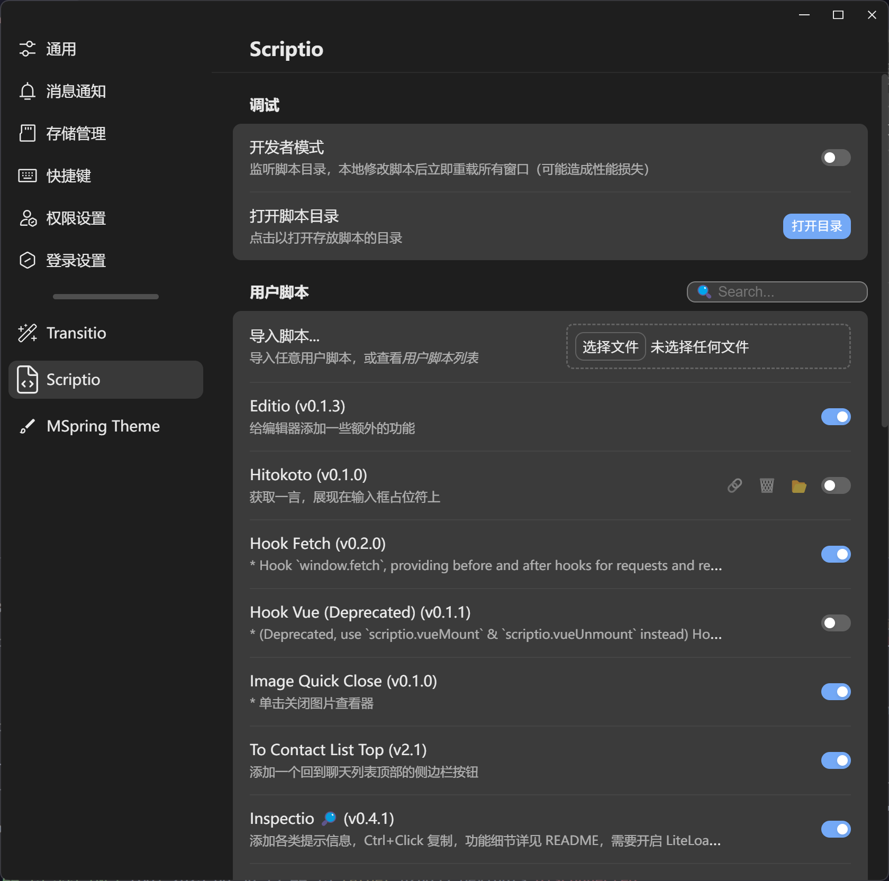

</img>

# Scriptio

[](https://github.com/PRO-2684/Scriptio/blob/main/LICENSE)
[](https://github.com/PRO-2684/Scriptio/blob/main/.github/workflows/release.yml)
[](https://github.com/PRO-2684/Scriptio/releases)
[](https://github.com/PRO-2684/Scriptio/releases)
[](https://github.com/PRO-2684/Scriptio/releases/latest)

> [!WARNING]
> 由于 [LiteLoaderQQNT](https://github.com/LiteLoaderQQNT/LiteLoaderQQNT) 没有良好的 ESM 支持，此插件将暂停支持此框架。若您仍需在 LiteLoaderQQNT 下使用，请使用 [`v1.4.5`](https://github.com/PRO-2684/Scriptio/releases/tag/v1.4.5) 及之前的旧版本。若您有良好的编程基础，亦可参考 [`llqqnt`](https://github.com/PRO-2684/Scriptio/tree/llqqnt) branch 的说明修改 LiteLoaderQQNT 框架后使用。

QwQNT 插件，用于为 QQNT 加载任意 **渲染层** 的用户脚本。

你可能也感兴趣：[Transitio](https://github.com/PRO-2684/transitio)，自定义用户样式加载器。

## 🪄 具体功能

- 导入/搜索/查看/删除用户脚本
- 启用/禁用用户脚本
- 用户脚本的实时响应

## 🖼️ 截图

> 演示中使用了 [MSpring-Theme](https://github.com/MUKAPP/LiteLoaderQQNT-MSpring-Theme)，主题色为 `#74A9F6`。



## 📥 安装

### 稳定版

下载 Release 中的 `scriptio-release.zip`，解压后放入相对应的 `plugins/Scriptio` 文件夹中即可。(若没有该文件夹请自行创建)

### CI 版

若想体验最新的 CI 功能，可以下载源码后同上安装。(仅需保留下面列出的文件)

完成后的目录结构应该如下:

```
plugins (所有的插件目录)
└── scriptio (此插件目录)
    ├── manifest.json (LiteLoaderQQNT 插件元数据)
    ├── package.json (QwQNT 插件元数据)
    ├── main.js (插件代码)
    ├── preload.js (插件代码)
    ├── renderer.js (插件代码)
    ├── settings.html (插件设置界面)
    ├── icons/ (插件用到的图标)
    └── modules/ (模块化的插件代码)
```

## 🤔 使用方法

> [!WARNING]
> 由于 js 代码的复杂性，禁用/修改部分脚本可能需要 **重启/重载生效**

- 导入脚本：在配置界面导入 JS 文件，或将之放入 `data/scriptio/scripts/` 文件夹。
    - 用户脚本的编写请参考 [Wiki](https://github.com/PRO-2684/Scriptio/wiki)。
    - 可以在此文件夹下创建多层目录，插件会自动扫描所有 JS 文件，但是设置界面导入的还是默认直接放在 `data/scriptio/scripts/` 下
- 搜索脚本：在设置界面搜索框中输入关键字即可。
    - 未聚焦到其它输入框时可以直接按下 `Enter` 键或 `Ctrl+F` 聚焦到搜索框
    - 根据空格将输入分解为多个关键词，所有关键词均大小写不敏感
    - 可以通过 `@` 符号筛选满足指定条件的脚本
        - `@enabled`/`@on`/`@1`：启用的脚本
        - `@disabled`/`@off`/`@0`：禁用的脚本
    - 搜索结果展示匹配 **所有普通关键词** 以及 **所有 @ 关键词** 的脚本
- 查看脚本
    - 鼠标悬停在脚本标题上时，会显示其绝对路径。
    - 鼠标悬停在脚本上时，会展示 "在文件夹中显示" 按钮。
- 删除脚本：鼠标悬停在脚本上并点击删除 `🗑️` 按钮，或进入，或进入 `data/scriptio/scripts/` 文件夹删除对应文件。
- 启用/禁用脚本：打开插件设置界面，将对应的脚本开关打开/关闭，支持的脚本即时生效。
    - 若点击各个开关速度过快，可能会导致错位等情况，此时请重载窗口。
- 更新脚本：重新导入后重启或重载即可。

## 💻 调试

- 开发者模式 (不推荐)：若您想要调试 **您的用户脚本**，可以在插件设置界面打开 *开发者模式*，此时插件会监控 `data/scriptio/scripts/` 文件夹，当发生更改时，会自动重载。
- Debug 模式：若您想要调试 **此插件本身**，可以使用 `--scriptio-debug` 参数启动 QQNT，此时插件会在控制台输出调试信息。

## 📜 用户脚本

> [!NOTE]
> 以下脚本均为由我/其它用户编写的用户脚本，不内置在插件中。
>
> 若你有愿意分享的脚本，欢迎 [提交 PR 或 Issue](https://github.com/PRO-2684/Scriptio/issues/1) 来将它们添加到这里。编写脚本前推荐先阅读 [Wiki](https://github.com/PRO-2684/Scriptio/wiki)。

访问 [此网址](https://pro-2684.github.io/?page=scriptio_userscripts) 查看用户脚本列表。

## ⭐ Star History

[](https://starchart.cc/PRO-2684/Scriptio)
